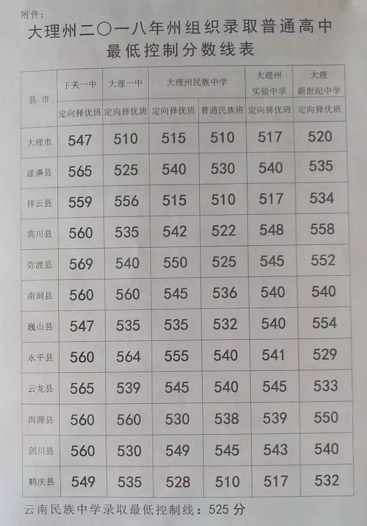

# 数学

## 人民教育出版社教材_八年级

电子书网址： http://www.shuxue9.com/pep/cz8s/ebook/7.html
http://www.shuxue9.com/pep/cz8s/ebook/161.html
http://www.shuxue9.com/pep/cz8s/ebook/167.html

http://www.shuxue9.com/pep/cz8s/ebook/001.jpg
http://www.shuxue9.com/pep/cz8s/ebook/167.jpg

# 英语

## 人民教育出版社教材_八年级
电子书网址:  http://www.wsbedu.com/wu51/keben.asp?wai=886&page=1

#  物理  

## 人民教育出版社教材_八年级
电子书网址:  http://www.wsbedu.com/wu51/keben.asp?wai=977&page=1

#  地理 
## 新球地图出版社_八年级

# 生物学

## 江苏凤凰教育出版社__八年级

#  化学

#  语文

# 道德政治

#  中国历史 

# 网站

            

| 网站名称 | 网址 | 备注 |
| ------ | ------ | ------ |
| 中考网 | http://www.zhongkao.com/    | X |
|  |  |  |

# 考试

## 云南大理中考

### 2018中考

#### 2018中考州录取线

